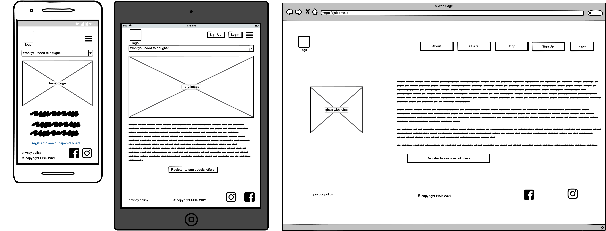
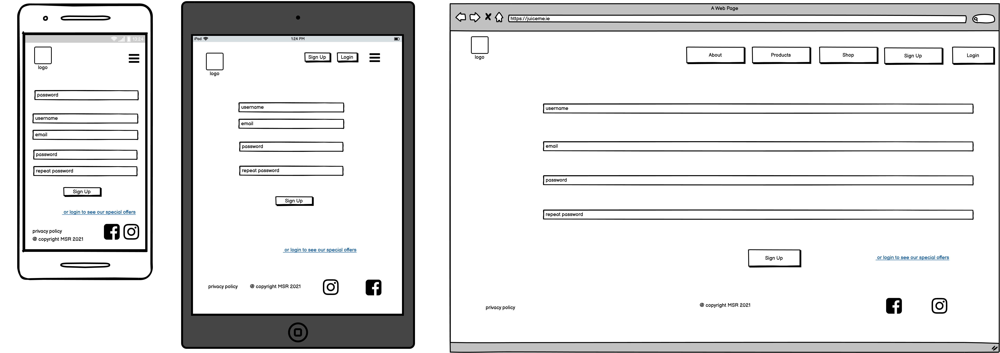
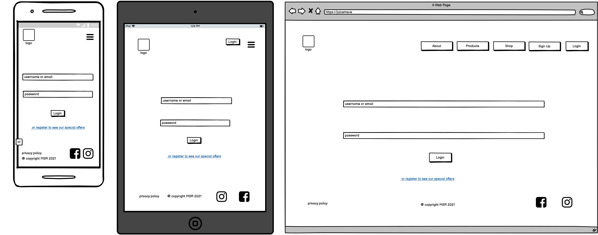
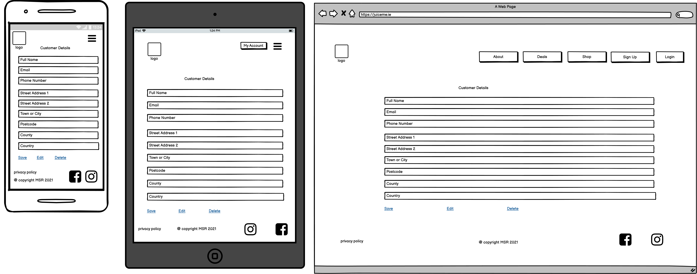
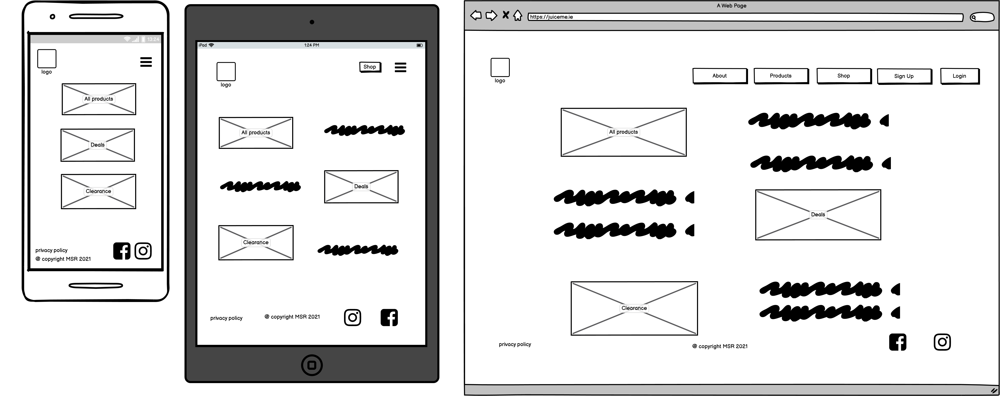
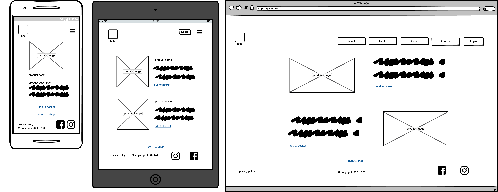
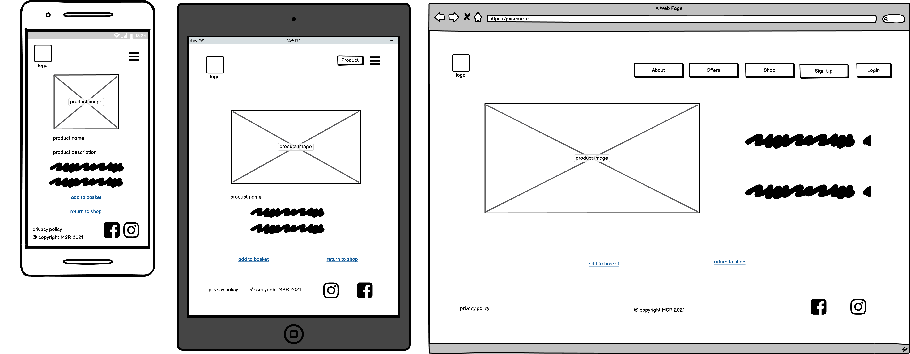
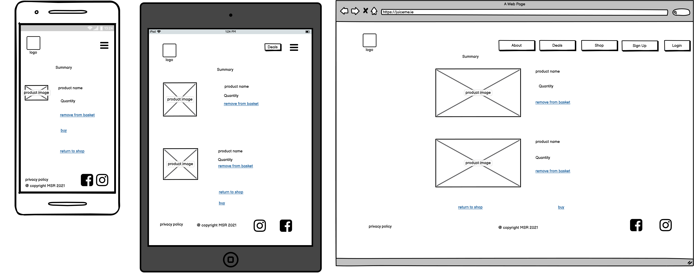

#  Juiceme Shop
live demo is available here ()

## Table of Contents

1. [Introduction](#Introduction)

2. [User Experience](#User-Experience)
    - [User stories](#User-stories)
    - [Admin stories](#Admin-stories)

3. [Design and colors](#Design-and-colors)
    
4. [Wireframes](#Wireframes)

5. [Features](#Features)

6. [Technology Used](#Technology-Used)

7. [Testing](#Testing)

8. [Deployment](#Deployment)

9. [Credits](#Credits)

10. [Disclaimer](#Disclaimer)

[Back to Top](#table-of-contents)

##  Introduction

##  User Experience
User experience is one of the most significant things when building a webpage. To do this properly, you should consider:
* who is your target audience,
* what they want to achieve by visiting your page, 
* which features will meet their expectations.

In this case, potential customers are:

1. Active, working women (making up about 3/4 of all customers).
2. Between 25 to 65 years old.
3. Some, of the mentioned group, have children and want to buy good quality products.
4. There is also a group of men who would like to improve their strength and prevent serious illnesses.
5. Most potential customers want to take care of their health.
6. All of them wish to buy good quality, healthy drinks at reasonable prices for themselves and their families.
7. They would like to know more about nutrients in particular fruits.
8. They also want to know what benefits from fruits they can absorb.
9. They mostly use smartphones and laptops.

### User stories

As a potential customer (first time visitor) I would like to:
+ Easily navigate through the whole page,
    + return to home page when logo is clicked,
    + open desired subpages (login/shop etc) in main nav,
    + open in new window all links inserted into the footer,
+ Easily browse the shopping product available in store,
+ Sort product by specific category,
+ Sort multiple categories of product simultaneously,
+ Search for product name or description,
+ View product price, description, rating and image in new page,
+ Easily create customer profile (registration for account),
+ Recive an email confirmation after registering. 

As customer (with own profile) I would like to do the same things as described above and:
+ Easily login/log out to personalised customer profile,
    + View personal order history,
    + View order confirmations,
    + Save payment information,
+ Intuitivly select quantity of product when purchasing products,
+ Easily recover password in case I forgot it,

### Admin stories
* I would like to be able to login to an administration panel,
* Be able to add, edit and delete product,
* Be able to create, edit and delete category of product,
* Make sure the user can't to be able to checkout an empty cart.

## Design
### Design and colors

This page has a white background to be much more readable for users, font colour is black to keep good contrast between text and background. The logo has purple, green, red and "dirty" yellow as main colours, so navigation, footer, headings and call to action (CTA) buttons and links have a combination of those main colours. 

 
### Wireframes
1. Home Page Wireframe

2. Register Page Wireframe

3. Login Page Wireframe

4. Customer Details Page Wireframe

5. Shop Page Wireframe 

6. Category Page Wireframe 

7. Product Page Wireframe

8. Basket Page Wireframe

### Features
#### Global

This website will be very simple and intuitive, to give my audience a great user experience.

That can be achieved by having:
1. A home button (text logo placed on the top left corner) in navigation.
2. Responsive menu placed on the right side of the page.
3. Visible and intuitive navigation bar during the browser the whole page.
4. A footer stuck at the bottom of each page with contact details on the left-hand side, Copyright information placed on the middle  and social media icons and Privacy Policy on the right-hand side, to follow shop on Instagram, Facebook and You Toube. Those links will open in separate pages.
I will begin by creating the mobile first design, because currently, most people look at websites on their smartphones before they check them online on bigger devices, such as tablets or laptops (and these are our customer's behaviours). 
Those features will apply to all of the pages on my website.
#### Home page
The home page is going to include all of the features listed above. It will also have a jumbotron with clearly described mission (one sentence) and button to visit this shop This is to give my audience brief info about the purpose of this page.
#### Shop page 
Contains all the available products in store.
#### Login page
This page allows the users to login to their personalised account or to create it when the visitor does not have their own profile yet.

## Technologies Used

* Required: HTML, CSS, JavaScript, Python+Django, Postgres, Stripe payments

#### Languages:

* HTML5
* CSS3
* JavaScript
* Python
#### Libraries, frameworks, tools used
* Balsamic to create wireframes,
* FontAwesome for icons used in this project,
* Freelogodesign was used to create shop logo,
* Favicon Generator was used to convert logo image into favicons,
* Google Fonts to use the Montserrat font for headings and Open Sans font for whole page,
* Pexels was used to find products images,
* MS Excel was used to create set of data needed to create database,
* MS Word was used to spellcheck my work, because English isn't my first language,
* Bootstrap framework was used for developing a responsive, mobile-first website,
* Django was used for rapid development, clean design and maintainable,
* jQuery was needed to simplify HTML DOM manipulation,
* VSC was used as a code editor,
* Git was used for version control,
* Github used as a Git repository hosting service
* Stripe is used to simplify the receive payments for the products available at store,
* W3C Validator to check that  HTML and CSS codes are properly wrirtten,
* PEP 8 Online Validator to check the Python code with expected standards,
* PostgreSQL as a database service provided directly by Heroku,
* 
* 
* 
## Testing

During production, the page was tested by me consistently to check each change I made. To carry out testing, I used Google Chrome Developer Tools.

Most of time I checked my code on HTML validator and pep8online to find my errors.

To see the problems fast  and have a chance to react I turned on the Problems tab in VSCode.

### Functionality
#### Admin stories

| Nr | Test          | Action | Test result |
| --- |:----------------|:--------------| :-----: |
| 1 | Easly navigate throught the whole page |  content on the web is strictly connected to the main topic and navigation is clearly and visible| PASS |
| 2 | Be able to login to an administration panel |  | PASS |
| 3 | Easly manage the whole product in store | Be able to add, edit and delete product | PASS |
| 4 | Easly manage all categories in store | Be able to create, edit and delete category of product | PASS|
| 5 | Make sure the user can't to be able to checkout an empty cart | | PASS/ NO PASS |

#### User Stories

| Nr | Test          | Action | Test result |
| --- |:----------------|:--------------| :-----: |
| 1 | Easly navigate throught the whole page | navigation on site is clearly and visible | NO PASS |
| 1.1 | Return to home page|  when you click the logo you return to home page  |PASS |
| 1.2 | Open desired subpages| each time when you decide to visit each page (i.e.: Shop, Login) you open intendent page| no |
| 1.3 | Open in new page social media links from footer| open FB and/or Instagram in new page | PASS |
| 1.4 | 
| 2 | Easly browse the products available in shop |  | PASS/ NO PASS |
| 2.1 | Easly sort product by specific category|  | NO PASS |
| 2.2 | Sort multiple categories of product simultaneously |  | PASS |
| 2.3 | Search  for product name or desctiption |  | PASS |
| 2.4 | View product price, description, rating and image in new page|  | NO PASS |
| 3 | Easily create customer profile |  | PASS/ NO PASS |
| 3.1 | Registration for account |  | PASS/ NO PASS |
| 3.2 |  Recive an confirmation email after registration |  | PASS/ NO PASS |
| 4 | Have a personalised account  |  | PASS/ NO PASS |
| 4.1 | Easly log in/out    |  | PASS/ NO PASS |
| 4.2 | View personal order history |  | PASS/ NO PASS |
| 4.3 | View order confirmation  |  | PASS/ NO PASS |
| 4.4 | Save payment informations  |  | PASS/ NO PASS |
| 4.5 | Intuitive select quantity of product when purchasing products  |  | PASS/ NO PASS |
| 4.6 | Easly recovery password when is forgotten |  | PASS/ NO PASS |

### Browser Compatibility
* Google Chrome 
* Firefox 
* Edge
* Safari
### Responsiveness (add report from am i responsible?)

Page is responsive. It was checked on phones, laptops and in dev tools. 

### Ligthouse Report

### Knowns Bugs

I made an error, because I exposed my Secret Key in github. I needed to remove it from there by deleting and commiting directly from github. Unfortunatley, I didn't push the changes from gitpod and I needed to fix it later on by pulling the changes from github and pushing my not updated commits. 

During production, I had a problem with connection to heroku and deployment (which wasn't easy for me :) ) and updating my database with my own data (I didn't have the fixtures). That probably was the worst part for me (except the troubles with the single product page). 

The page has a minor error which doesn't allow users to open the single page and add product to the bag. I checked my code, and can't find the solution. Due to my time to finish this project being very limited I decided to assign it as a know bug. 

Another error (that started today) is that the nav bar doesn't display properly, even though it was working yesterday, but now the hamburger menu is not working as I wanted. 

The issue is also with the my account section, which is not displaying as the dropdown menu.

I wanted to add the privacy policy to my app, but I did't know how to do it. I made it by adding link to the privacy policies page, but I did't create the proper policy. I assigned it as the left to implement solution, just like the using the social media to easly login to page. This allows visitors to create an account and save their time. I would also be able to track the visitors (to know how long they stay on page etc.).

My endpoint (webhook) doesn't work properly.

[Back to Top](#table-of-contents)

## Deployment

[Back to Top](#table-of-contents)

## Credits
Bootstap, Django and Stripe documentation. If a source is not mentioned below, then additional information about an original code, which was changed according to my website's needs, is mentioned in other files.
### Code
Denis Ivy, JustDjango platform, FreeCodeCamp and Programming with Mosh and their tutorials. I also used Slack, Stack Overflow, Tutors CI and took an inspirations from previous project created by CI students and by CI Hackathons teams (where I was a participant).
[Back to Top](#table-of-contents)

### Content
This was written by me after researching information about the topic. To create that content I visited few pages such 
* https://krokdozdrowia.com
* https://www.medicover.pl
* https://www.poradnikzdrowie.pl
* https://prostehistorie.com.pl
* https://dietetycy.org.pl
* https://zywienie.medonet.pl
* https://en.wikipedia.org
* 

[Back to Top](#table-of-contents)

### Media
#### Images
All images are taken from Pexels.com and authors are listed below:
* Charlotte May
* Valeria Boltneva
* Isabela Mendes
* Lisa
* Anastasia Zhenina
* Wendy Routman
* Aleksander Mils
* Bruno Scramgnon
* Naim Benjelloun
[Back to Top](#table-of-contents)

### Acknowledgements
I want to thank my Mentor, who has helped me with this project, and my family and friends who have supported me throughout the course of this project :)
[Back to Top](#table-of-contents)

### Disclaimer
This project was created for educational use only.
[Back to Top](#table-of-contents)
